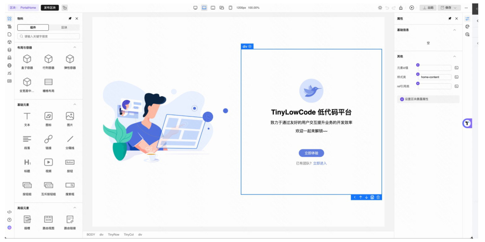
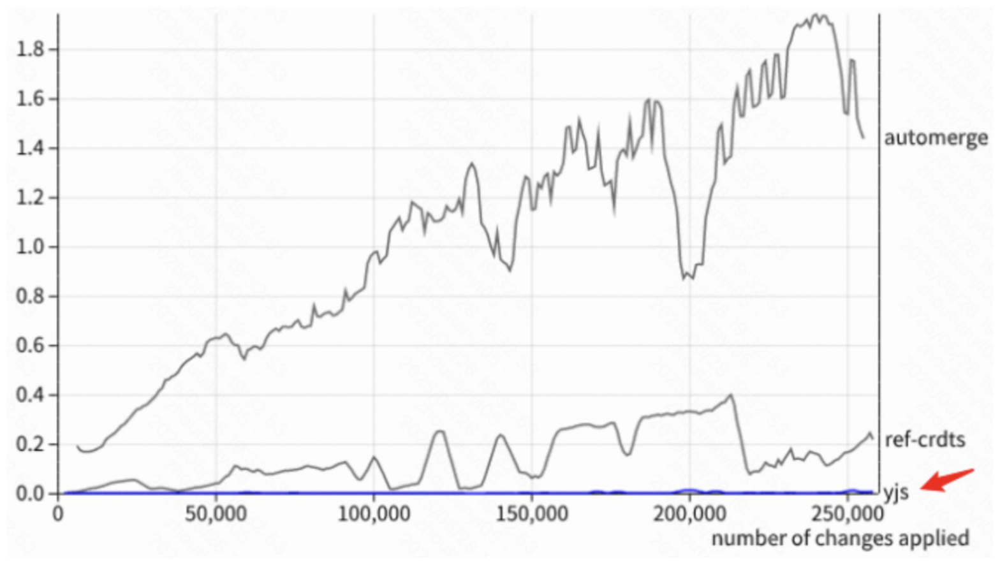
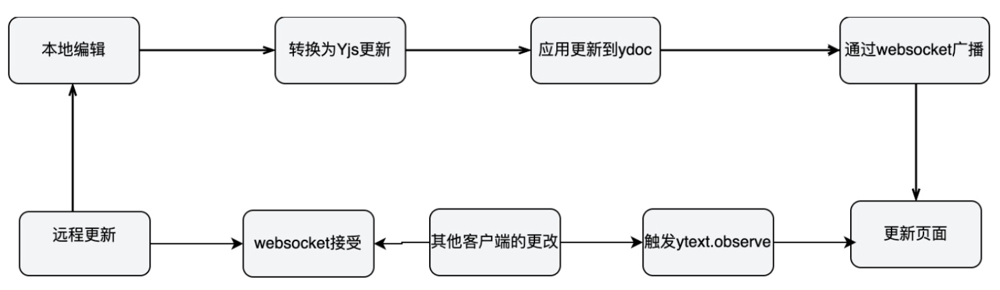
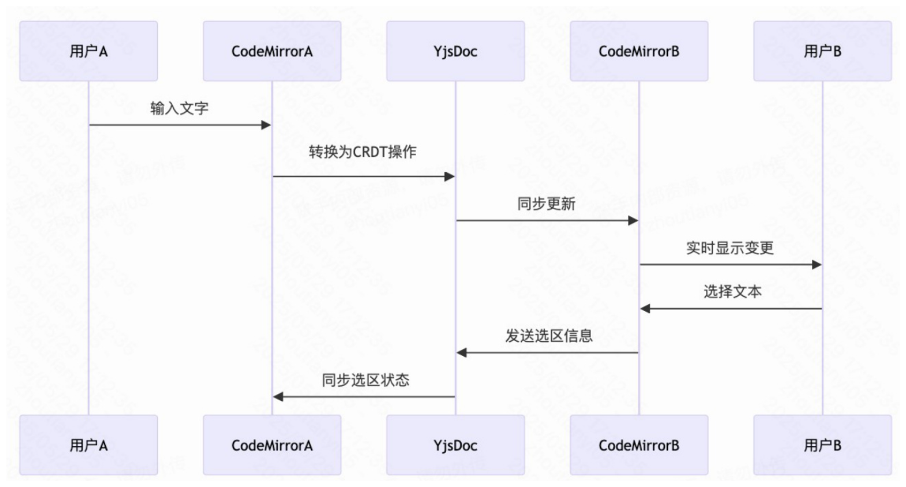
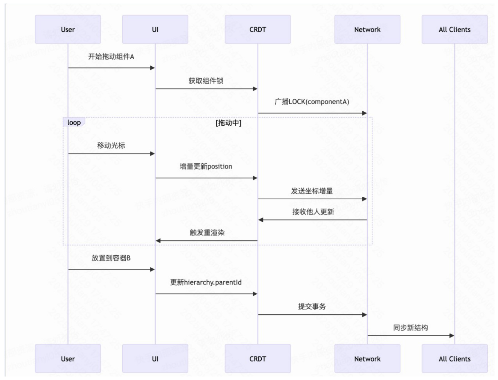
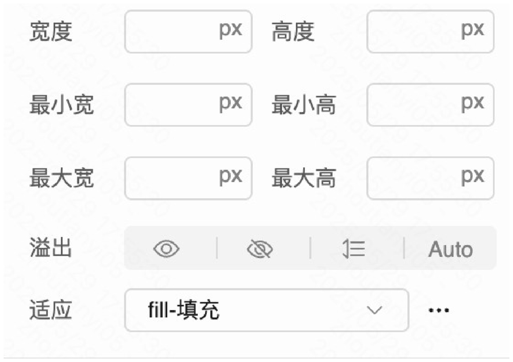
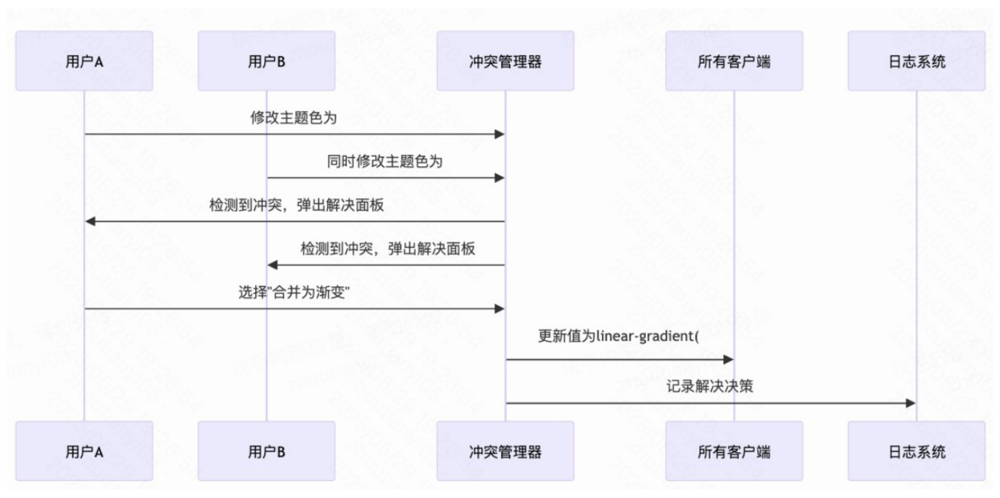
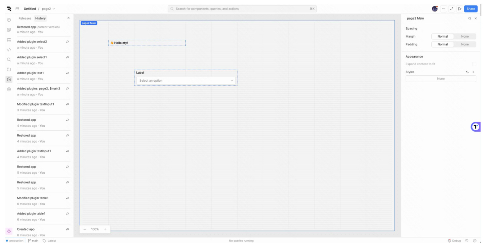

# 项目申请书

> 项目名称：TinyEngine 低代码引擎支持多人协作能力
> 项目导师：徐新宇 853047901@qq.com
> 项目申请人：周天意 2739022972@qq.com
> 日期：2025.5.10

# 目录
- [项目申请书](#项目申请书)
- [目录](#目录)
- [1.项目背景](#1项目背景)
  - [1.1 项目基本概况](#11-项目基本概况)
  - [1.2 项目基本需求](#12-项目基本需求)
    - [1.2.1 实现多人协作功能](#121-实现多人协作功能)
    - [1.2.2 提供版本控制和冲突解决机制，确保数据的一致性和完整性。](#122-提供版本控制和冲突解决机制确保数据的一致性和完整性)
    - [1.2.3 .支持消息通知和协作工具，提高团队协作效率](#123-支持消息通知和协作工具提高团队协作效率)
    - [1.2.4 .提供详细的文档和示例代码，确保用戶能够轻松使用该功能。](#124-提供详细的文档和示例代码确保用戶能够轻松使用该功能)
- [2.项目实现难点与方案](#2项目实现难点与方案)
  - [2.1 多人协作的实现与冲突解决](#21-多人协作的实现与冲突解决)
      - [2.1.1 编辑行为分类](#211-编辑行为分类)
        - [用户的操作行为大致分为三种：](#用户的操作行为大致分为三种)
    - [2.1.2 可选方案](#212-可选方案)
    - [2.1.3 代码 demo](#213-代码-demo)
        - [拖动行为：](#拖动行为)
      - [点击事件：](#点击事件)
  - [2.2 消息通知与协作工具的实现](#22-消息通知与协作工具的实现)
    - [2.2.1 光标](#221-光标)
  - [2.3 历史版本控制](#23-历史版本控制)
    - [2.3.1 方案选择](#231-方案选择)
    - [2.3.2 实现方式](#232-实现方式)
    - [2.3.3 代码](#233-代码)
- [3.时间规划](#3时间规划)
  


# 1.项目背景

## 1.1 项目基本概况

项目地址：https://github.com/opentiny/tiny-engine项目介绍：TinyEngine 是一款低代码引擎，支持可视化拖拽式开发，提供丰富的组件和功能，可以帮助开发者快速构建应用程序。

主要文件主要内容：

```markdown
├── block-compiler  
├── blockToWebComponentTemplate  
├── build  
├── builtinComponent  
├── canvas  
├── common  
├── configurator  
├── design-core  
|── engine-cli  
|── i18n  
|── layout  
├── plugins  
├── register  
├── settings  
├── svgs  
├── theme  
├── toolbars  
├── utils  
├── vue-generator  
└── webcomponent
```

## 1.2 项目基本需求

### 1.2.1 实现多人协作功能

当前 Tiny Engine 尚未具备支持多用戶同时编辑同一⻚面的能力，仅有上锁功能，进行上锁才能开始编辑，引入多人协作能力，能够提升平台的协作体验，使其更适用于设计团队、产品团队等需要多人共同创作的工作流。

- 功能需求：多人可以同时编辑同一页面。
- 页面可以分为三个部分：
  1. 左侧为页面全局资源管理区（包括物料，大纲树，区块管理，页面管理等）；
  2. 中间为页面编辑页；
  3. 右侧组件属性编辑区，用于编辑组件样式属性



==**同时应该注意的是并不是所有用户行为都需要进行协同同步，我们只对一些用户确定对页面产生影响的操作进行协同同步。**==

---

### 1.2.2 提供版本控制和冲突解决机制，确保数据的一致性和完整性。

多人协作势必会导致冲突问题，用戶需要能够回溯历史版本、查看具体更改、解决编辑冲突等功能，以保障协作的安全性与可靠性。

- 功能介绍与需求：
  1. **支持⻚面或组件的版本管理**，记录用戶的每次关键操作，确保在任何时候都可以查看和恢复历史内容。
  2. **实现冲突检测与提示机制**，在用戶间操作冲突时提供合并建议或回退选项，保障数据不丢失、不覆盖。
  3. 提供变更历史浏览能力，用戶能够追踪每一次改动的来源，**了解谁、在何时、对内容做了哪些修改**。

---

### 1.2.3 .支持消息通知和协作工具，提高团队协作效率

在多人使用同一平台进行协同创作时，仅依赖编辑同步远远不够。缺乏消息通知机制和基本的协作工具，容易导致信息滞后、协作混乱，甚至出现误改、重复劳动等问题。  
Tiny Engine 当前缺乏这些协作辅助能力，建设一个基于实时消息与事件的协作辅助系统，将显著提升团队使用平台的整体效率与流畅度。

- 功能介绍与需求：
  1. 基础消息通知功能：在⻚面或组件发生重要更改（如保存、发布、切换⻚面等）时，向其他协作者发送简洁的提示信息；支持⻚面内的系统级消息弹窗或提示栏，不打断编辑流程。
  2. 操作提醒与协作提示：显示当前在线成员列表；当他人正在编辑某个组件时显示“正在编辑”提示，避免编辑冲突。

类似如下效果：  
==（光标同步）==


---

### 1.2.4 .提供详细的文档和示例代码，确保用戶能够轻松使用该功能。

多人协作功能涉及多个模块（如数据同步、权限控制、版本管理等），使用上较为复杂，若缺乏清晰的文档和示例代码，将大大增加用戶理解和接入的成本。  
特别是对于企业内部集成或二次开发场景，良好的文档体系是提升功能易用性和开发效率的关键。因此，有必要为多人协作相关功能提供系统的使用说明与示例代码支持，帮助用戶快速上手、顺利集成。

# 2.项目实现难点与方案

## 2.1 多人协作的实现与冲突解决

#### 2.1.1 编辑行为分类

首先可以明确的是作为左侧静态资源的物料区，顶部区域，是不需要接入多人协作功能的；其他大部分用户可以操作的地方都需要接入多人协作功能。

##### 用户的操作行为大致分为三种：

1. ==拖动行为==：包括拖动物料到页面编辑区，左侧侧边栏中拖动 DOM 树结构，这也是我们低代码平台最重要的一个行为
2. ==点击行为==：包括在右侧侧边栏样式中通过鼠标点击改变组件样式，在中部页面编辑区通过点击删除或复制物料等等。
3. ==输入（编辑）行为==：**包括编辑物料文本内容，绑定事件时编辑函调函数的 js 代码**，在右侧侧边栏编辑物料样式等等。上面只是对相关行为的一些举例，并不全面。

### 2.1.2 可选方案

多人协作进行实时编辑实际上实现方式很多，有 webRTC 和 webSocket，**这里我们优先选择 webSocket**。

真正的难点是在于如何处理冲突，==这里 CRDT（无冲突复制数据类型）是一个很好的选择==，前端 CRDT 有三个选择方案分别是 **Yjs，automerge 和 ref-crdts**。这三者的性能对比，可以参考下面这个图。


==Yjs 性能极其优秀，我们选择 Yjs。==

### 2.1.3 代码 demo

流程说明  

```typescript
// client.ts
import * as Y from "yjs";
import { WebsocketProvider } from "y-websocket";
import CodeMirror, { Editor } from "codemirror";
import "codemirror/mode/meta";
// 创建共享文档
const ydoc: Y.Doc = new Y.Doc();
快手内部文档请勿外传;
// WebSocket 连接配置
const wsProvider: WebsocketProvider = new WebsocketProvider(
  "ws://localhost:1234",
  "my-room",
  ydoc,
  {
    connect: true,
  }
);
// 初始化编辑器
const editorContainer = document.getElementById(
  "editor"
) as HTMLTextAreaElement;
const editor: Editor = CodeMirror.fromTextArea(editorContainer, {
  lineNumbers: true,
  mode: "text/plain",
  viewportMargin: Infinity,
});
// 绑定 Yjs 文本类型
const ytext: Y.Text = ydoc.getText("codemirror");
// 同步远程更新到编辑器
const observer = (event: Y.YTextEvent) => {
  if (event.transaction.origin !== wsProvider) {
    editor.setValue(ytext.toString());
  }
};
ytext.observe(observer);
// 同步本地编辑到 Yjs
editor.on("change", (instance: Editor, changes: CodeMirror.EditorChange) => {
  const update = Y.encodeStateAsUpdate(
    ydoc,
    Y.convertUpdateFormat(
      JSON.stringify(changes), // 将变更转换为 Yjs 格式
      (update: Uint8Array) => Y.mergeUpdates([update])
    )
  );
  快手内部文档请勿外传;
  Y.applyUpdate(ydoc, update, wsProvider);
});
// 断开连接清理
wsProvider.on("status", (event: { status: string }) => {
  if (event.status === "disconnected") {
    ytext.unobserve(observer);
  }
});
```

（这里选择 CodeMirror 是因为他是一个基于 JavaScript 的通用文本编辑器组件，主要面向代码编辑场景，可以用于页面 JS 编辑。）

后端：

```typescript
// server.ts
import { WebSocketServer } from "ws";
import { setPersistence, setupWSConnection } from "y-websocket/bin/utils";
import * as Y from "yjs";
const wss = new WebSocketServer({ port: 1234 });
setPersistence({
  bindState: async (docName: string, ydoc: Y.Doc) => {
    // 持久化逻辑（可选）
  },
  writeState: async (docName: string, ydoc: Y.Doc) => {
    // 写入状态逻辑（可选）
  },
});
wss.on("connection", (ws, request) => {
  setupWSConnection(ws, request, {
    gc: true, // 启用垃圾回收
  });
});
console.log("Yjs WebSocket server running on ws://localhost:1234");
```

整体链路：



##### 拖动行为：

拖动行为是低代码平台可视化的重要实现方式，**实现拖动行为的实时编辑与文档实时编辑大有不同。 此外因为涉及到视图的更新，性能也是一个很大的问题。**

<html><body><table><tr><td>维度</td><td>文档协同编辑</td><td>拖动行为协同</td></tr><tr><td>数据结构</td><td>线性文本(字符串/CRDT)</td><td>树形结构(JSON/DOM树)</td></tr><tr><td>操作粒度</td><td>字符级变更</td><td>组件级移动/属性变更</td></tr><tr><td>冲突处理</td><td>CRDT自动合并</td><td>需操作顺序协调</td></tr><tr><td>状态同步</td><td>文本差异同步</td><td>坐标/父子关系同步</td></tr><tr><td>实时反馈要求</td><td>中等(100-300ms)</td><td>极高(<50ms)</td></tr><tr><td>典型操作类型</td><td>Insert/Delete/Update</td><td>DragStart/Move/Drop/ Resize</td></tr></table></body></html>

==我们可以为物料拖动设计一个数据结构，以便进行配合 Yjs 进行 CRDT。==

```typescript
// 物料类型体系
type MaterialCategory =
  | 快手内部文档请勿外传
  | "基础组件"
  | "容器组件"
  | "业务组件"
  | "自定义组件";
type ComponentType = {
  category: MaterialCategory;
  name: "Button" | "Input" | "Chart" | "GridLayout" | string; // 标准+自定义类型
  icon: string; // 组件图标 URL
  version: string; // 物料版本号
};
// 组件基础定义
interface ComponentCore {
  id: string; // UUIDv4
  type: ComponentType;
  version: {
    client: number; // 客户端版本（CRDT 自动维护）
    material: number; // 物料版本（用于热更新）
  };
  lock?: {
    owner: string; // 操作者 ID
    timestamp: number;
  };
}
// 尺寸系统（支持响应式）
type DimensionUnit = "px" | "%" | "vh" | "vw" | "auto";
interface ComponentSize {
  width: {
    value: number;
    unit: DimensionUnit;
    min?: number;
    max?: number;
  };
  height: {
    value: number;
    unit: DimensionUnit;
    min?: number;
    max?: number;
    快手内部文档请勿外传;
  };
  aspectRatio?: number; // 锁定宽高比
}
// 增强布局定义
interface LayoutPosition {
  x: {
    value: number;
    unit: "px" | "%";
    relativeTo?: "parent" | "sibling"; // 相对定位基准
  };
  y: {
    value: number;
    unit: "px" | "%";
    relativeTo?: "parent" | "sibling";
  };
  rotation: number; // 旋转角度
  flip: { x: boolean; y: boolean }; // 翻转状态
}
// 嵌套关系（支持多层级）
interface ComponentHierarchy {
  parentId: string | "ROOT";
  children: Array<{
    id: string;
    order: number; // 基于链表的位置索引
    attachPoint?: "left" | "top" | "center"; // 吸附锚点
  }>;
}
// 完整组件结构（CRDT 实现）
type DraggableComponent = ComponentCore & {
  size: Y.Map<ComponentSize>;
  layout: Y.Map<LayoutPosition>;
  hierarchy: Y.Map<ComponentHierarchy>;
  props: Y.Map<any>; // 可序列化属性
  styleBindings: Y.Array<string>; // CSS-in-JS 绑定
  _localState: {
    // 非协同状态
    isDragging: boolean;
    transformOrigin: DOMRect;
    快手内部文档请勿外传;
  };
};
// 画布状态树
class CanvasState {
  components: Y.Map<Y.Map<DraggableComponent>>; // 基于 Map 的 CRDT 存储
  viewport: {
    resolution: [number, number]; // 设计分辨率
    breakpoint: "desktop" | "tablet" | "mobile"; // 响应式断点
  };
  materialLib: Y.Array<ComponentType>; // 当前可用物料库
}
```



#### 点击事件：

**一般是样式或者属性的修改通过点击事件修改**。可视化开发是低代码的主要特征，因此在开发过程中，如果涉及复杂的配置，不可避免地需要使用表单来承载。比如下面这个例子，一个表单组织一次复杂配置的过程，是很常见的：



如果表单上的修改未能及时保存下来，有人在某个表单上编辑的同时，恰好另一个人也打开了同一个表单开始配置，这个情况下，冲突就出现了。  
同时一个属性依赖于另一个属性的方式也有可能出现，一个用户修改一个属性导致了另一个用户样式失败或者冲突。  
此外，表单上的配置项一般是他人进行属性配置的结果如果直接合并冲突覆盖掉一个人的配置，会导致用户非常不好的体验。  
**我们可以给属性配置提供“ 确认按钮 ”，如果有冲突，则可视化冲突，由造成冲突用户解决冲突。**



构造一个适合 CRDT 的表单数据结构

```typescript
// 表单配置项数据结构（CRDT 扩展）
type FormConfigItem = {
  key: string; // 唯一标识符如"buttonStyle.width"
  value: Y.Map<any>; // 支持多类型值
  version: {
    clientId: string; // 最后修改客户端 ID
    timestamp: number; // 逻辑时钟
  };
  dependencies: string[]; // 依赖项 keys 数组
  conflictResolution?: "manual" | "auto-merge"; // 解决策略
};
// 冲突记录结构
interface ConflictRecord {
  key: string;
  versions: Array<{
    user: string;
    value: any;
    timestamp: number;
  }>;
  resolutionHistory: Array<{
    decision: "keep" | "override" | "merge";
    byUser: string;
  }>;
}
快手内部文档请勿外传;
// 增强的表单状态管理器
class FormStateManager {
  configs: Y.Map<FormConfigItem>;
  conflicts: Y.Array<ConflictRecord>;
  dependencyGraph: Map<string, Set<string>>; // 依赖关系图
}
```

## 2.2 消息通知与协作工具的实现

### 2.2.1 光标

编辑文本消息通知的代码比较简单，即光标实时同步。同时在光标上实时显示编辑用户名字。

```typescript
// 光标状态类型定义
type CursorState = {
  // 基于配置项路径的定位：'components[0].props.style.width'
  focusPath: string;
  // 相对定位坐标（百分比适应不同分辨率）
  position: {
    x: number; // 0~1 表示元素宽度百分比
    y: number; // 0~1 表示元素高度百分比
  };
  // 选择范围（支持跨组件）
  selection?: {
    startOffset: number;
    endOffset: number;
    anchorPath: string;
  };
  lastUpdated: number; // 时间戳用于淘汰旧数据
};
// 用户元数据（头像、颜色标识等）
type UserMeta = {
  id: string;
  name: string;
  快手内部文档请勿外传;
  avatar: string;
  color: string; // 用户专属颜色
};
// 使用 Yjs Awareness 管理实时状态
const awareness = new awarenessProtocol.Awareness(ydoc);
```

## 2.3 历史版本控制

### 2.3.1 方案选择

现有的历史控制，_只能对用户一小段时间的行为进行前进和后退_，并不能做到广义上的历史版本控制。看市面上的竞品我们可以发现，**多数历史版本控制是针对某一个行为操作生成一个快照**，用户可以选择回退与撤销，我们可以借鉴这个行为模式，实现自己的历史版本控制。
（市面产品的历史控制如下：）


==可选：时间有富余的话可以尝试实现类似于 git 的分支系统，用户可以根据不同分支进行开发，并且支持分支的合并与冲突解决。（基于 git 的版本管理）==

### 2.3.2 实现方式

版本历史控制的实现有两个关键点：

1.  **版本信息的描述，用户需要知道这个版本干了什么；**
2.  **版本切换的实现。**

由于我们这个是个低代码项目，不仅仅是纯文本，还涉及到页面 UI 的变化与 UI 样式和属性的配置，实现思路需要创新。

### 2.3.3 代码

- 结构化元数据

```typescript
{
 "versionId": "v2.1.0",
 "timestamp": "2023-08-15 14:30:00",
 "author": "user@example.com",
 "description": "修改登录页布局，增加密码强度校验",
 "changeType": ["UI", "LOGIC"], // 变更分类
 "snapshot": {
    "ui": "screenshot_20230815.png", // 自动生成的页面截图
    "components": ["LoginForm", "PasswordValidator"] // 涉及的核心组件
    }
}
```

- 版本切换（核心代码）

```typescript
class VersionManager {
  // 加载目标版本
  async loadVersion(versionId) {
    // 1. 获取版本元数据
    const meta = await fetchVersionMeta(versionId);
    // 2. 加载快照配置
    const snapshot = await fetchSnapshot(meta.snapshotPath);
    // 3. 检查当前状态冲突
    const conflicts = detectConflicts(currentState, snapshot);
    // 4. 重建应用状态
    const newAppState = this.rebuildState(snapshot);
    // 5. 更新视图
    快手内部文档请勿外传;
    renderEngine.render(newAppState);
    // 6. 记录审计日志
    logAudit("VERSION_SWITCH", versionId);
  }
  // 重建状态机
  rebuildState(snapshot) {
    return {
      components: this.parseComponentTree(snapshot),
      variables: snapshot.globalVariables,
      dataSources: snapshot.dataSources,
    };
  }
  // 组件树解析
  parseComponentTree(node) {
    const component = componentFactory.create(node.type);
    component.applyProps(node.props);
    component.applyStyles(node.styles);
    if (node.children) {
      node.children.forEach((child) => {
        component.addChild(this.parseComponentTree(child));
      });
    }
    return component;
  }
}
```

# 3.时间规划
- [ ] 7.01 - 7.7 多人协作能力搭建  
- [ ] 7.08 - 7.20 多人协作集成到⻚面搭建中，冲突解决实现  
- [ ] 7.21 - 8.05 版本控制界面搭建，版本控制逻辑实现，支持历史版本回溯  
- [ ] 8.05 - 8.20 冲突可视化 UI 搭建，冲突解决的逻辑实现，实现冲突部分的可视化（类似 GitHub， vscode），支持多种解决冲突方式（手动解决 或 最后修改优先）
- [ ] 8.21 - 9.10 消息通知与协作工具搭建，弹窗 UI 实现 
- [ ] 9.10 - 9.30 联调测试，输出文档
